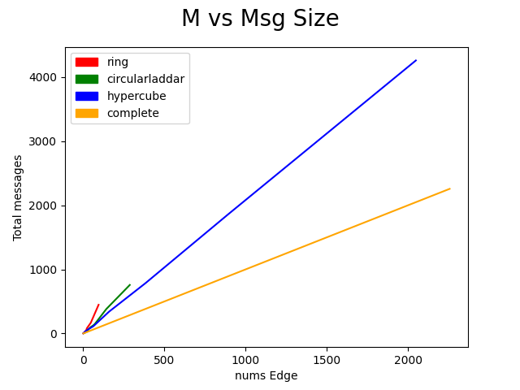
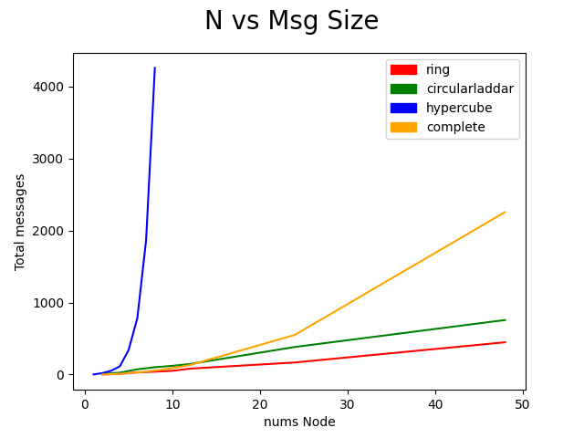
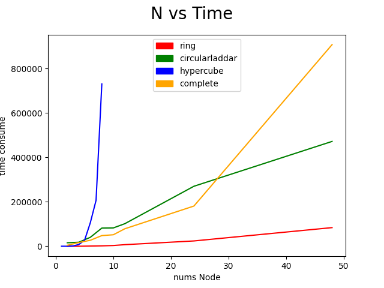
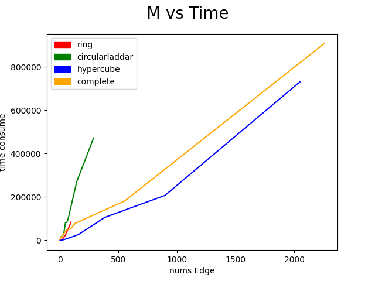
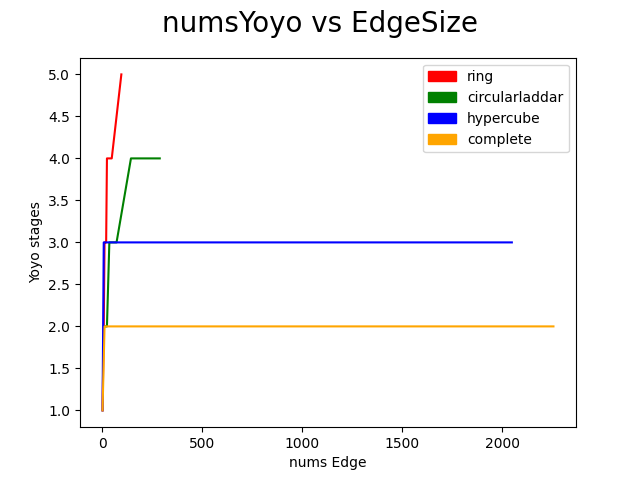
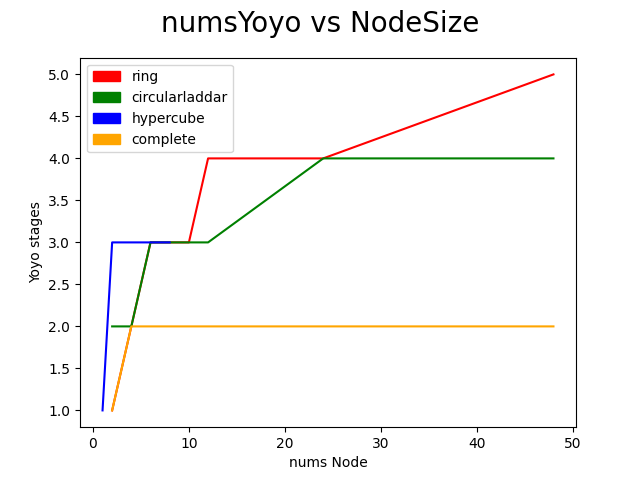

# Assignment 3 Report 

## Introduction 

- The project compose creating generic concurrent implementation of Yoyo algorithm. Furthermore the project expands the limitation on applying various classical topology
  1. Circular Laddar Topology

  2. Ring Topology 

  3. HyperCube Topology 
       
  4. Complete Graph 

## Result 

1. Some of the figure can be used to display the result 
    - Message vs Nums of Edge 
      - 

    - Message vs Nums of Node 
      - 

    - Time vs Nums Node
      - 

    - Time vs Nums edge
      - 

    - NumsYoyo vs Nums edge
      - 
    
    - NumsYoyo vs Nums Node
      - 

2. We can see the message complexity has heavier connection toward edge size. It make sense as the Yoyo complexity is $2m + 2mlog(s)$ in which it appears complete graph has the highest run time and message among all topology. 

3. Yoyo Stages tends spends more time on cicylic graph. 

4. HyperCube as the greatest N and M increases thus has highest messages and highest time consuming as well.

## Conclusion 

- Yoyo tends work well on a graph with less numbers of edges, as it doesn't consume additional message to perform YoDown and Pruning messages. 